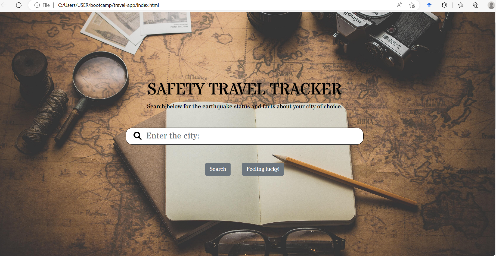

# Travel-Tracker App
Bootcamp project

Travel-Tracker App Project

## Description

This is a safety travel tracker app. This app will help you know about the city you are going to travel to. The Travel tracker app will summarize the most important information on the earthquake status of that city and the country.

The travel tracker app gives you up-to-date information on earthquake status and facts about the country. Today, traveling is much more complicated than before, wars, natural disasters, diseases and economic crisis are things we need to think about during travel plans.

Advances in Technology have been proven to be helpful. This Travel tracker app integrated data from two server-side APIs request from openweathermap.org and rapidapi latest earthquake near me apps. We also integrated google map which displays the map of the city, country and the countries that they shared borders with.

The app was created using agile development methodologies. We implemented feature and bug fixes using git branch workflow and pull requests.

https://michalous.github.io/travel-app/

## Usage

We created the travel app using what we have learned so far from the Bootcamp. These includes Html, Javascript, CSS, and Bootstrap. We also implemented the front-end foundations which covers the fundamental concept of web development such as front-end technologies command-line fundamentals, user experience design APIs,Git and Github, third-party APIs, server-side APIs, Ajax, Json and Agile software development methodologies. 

The travel app was designed to be responsive so that it will scale with the size of your screen, this way no matter the size of your screen, the Html tag will shrink or expand accordingly and not break the page.   

In the Html, we incorporated Jumbotron feature for calling extra attention to the travel app search for information on earthquake status and facts about your city of choice and the background image. We also used Boostrap modal component a dialog popup/box window that a user will use for choosing their destination.

As a user click the search button with the input of the city of their choice, the travel app will display the last earthquake close to that city and its magnitude. It will also display the flag of the country with it's map and facts about the city and the country. The travel app also display the stored previous searches.

## Credits

Collaborators:

Michal Skalsky: https://github.com/Michalous

Monica Lewis: https://github.com/monicaclarelewis 

Musleha Begum: https://github.com/Musleha1

Osita Nduka: https://github.com/OsitaNduka

Third-Party assets for countdown button:  https://github.com/bradtraversy/50projects50days

## License

Please refer to the License in the repo.

